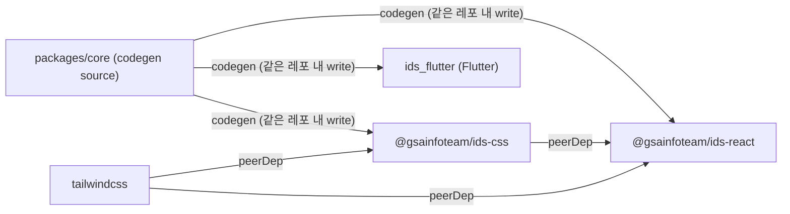

# IDS 아키텍처

## 레퍼런스

**토큰 / codegen**

- https://styledictionary.com/ — ids-core codegen 도구. 토큰 JSON → CSS / TS / Dart 변환.
- https://tokens.studio/ — Figma에서 디자인 토큰을 편집하고 GitHub에 sync하는 플러그인. (보류)
- https://www.designtokens.org/tr/2025.10/ — 디자인 시스템 JSON 표준 스펙.

**레퍼런스 디자인 시스템**

- https://toss.tech/article/tds-color-system-update — Single source of truth 토큰 파이프라인 설계 참고.
- https://seed-design.io/docs — 크로스플랫폼 디자인 시스템 구조 참고.
- https://base-ui.com/react/overview/quick-start — headless, 접근성 우선 철학 참고. (직접 의존하지는 않음)

---

## 1. IDS란

**Infoteam Design System**. GIST 인포팀이 운영하는 여러 서비스(지글, 팟쥐 등)의 UI를 일관되게 유지하고, 신규 서비스 개발 속도를 높이기 위해 만드는 크로스플랫폼 디자인 시스템.

- React (Web) / Flutter (Mobile) 두 플랫폼을 동시 지원
- 단순한 컴포넌트 라이브러리가 아닌 **선언적 UI 문법(Declarative UI Syntax)**
- 개발자는 UI의 의도만 선언하고, 시각적 디테일·접근성·상태 처리는 시스템이 담당

---

## 2. 설계 철학

### Single Source of Truth

토큰 이름 체계, 팔레트 값, 열거형(Size/Intent/Variant) 등 모든 설계 결정의 원본은 `ids-core` 레포 하나에 존재한다. React와 Flutter는 이 원본을 codegen으로 받아 사용한다.

### 정적 팔레트

초기 설계에서 동적 OKLCH 팔레트 생성을 고려했으나, 다음 이유로 **정적 팔레트**로 결정했다.

- 런타임 OKLCH 연산이 불필요하게 복잡함
- 접근성(대비비) 보장이 어려움 — 수식이 아닌 디자이너 검수로 보장해야 함
- SSR 환경에서 FOUC(Flash of Unstyled Content) 위험
- Style Dictionary 같은 검증된 도구 활용 불가

팔레트는 IDS가 소유하고 접근성 검수를 거쳐 등록된다. 새 색상이 필요하면 `ids-core`에 PR을 올리고 CI 자동 검수를 통과해야 한다.

### Color prop

서비스는 IDS 팔레트에서 색상을 고른다. `ThemeProvider`와 개별 컴포넌트 모두 `color` prop을 지원하며, 명시하지 않으면 가장 가까운 부모의 color를 상속한다.

```tsx
// 앱 전체
<ThemeProvider color="blue" mode="light">

// 특정 섹션만 교체
<ThemeProvider color="orange">
  <PromoBanner />
</ThemeProvider>

// 개별 컴포넌트도 독립적으로
<Button color="orange" variant="solid">특별한 버튼</Button>
```

---

## 3. 레포 구성

**단일 모노레포** (`gsainfoteam/ids`). pnpm workspace + Turborepo로 JS 패키지 관리. Flutter는 Dart라 workspace 밖이지만 같은 레포에 공존.

- **pnpm workspace** — 패키지 간 로컬 의존성 연결, 공통 의존성 호이스팅
- **Turborepo** — 태스크 파이프라인 정의 (`css` 빌드 완료 후 `react` 빌드 등), 로컬 빌드 캐시
- **Changesets (fixed mode)** — 버전 bump, CHANGELOG 생성, GitHub Packages publish 자동화

```
ids/                          # 모노레포 루트
  packages/
    core/                     # 파일 저장소. 패키지 아님. 빌드 시스템 없음.
    css/                      # @gsainfoteam/ids-css npm 패키지
    react/                    # @gsainfoteam/ids-react npm 패키지
    flutter/                  # ids_flutter pub 패키지 (Dart)
  package.json                # pnpm workspace root
  pnpm-workspace.yaml
  turbo.json                  # Turborepo 태스크 파이프라인
  .changeset/                 # Changesets 설정 (fixed mode)
  .github/workflows/
    codegen.yml               # tokens/** 변경 시 SD build → 각 패키지에 직접 write & commit
    ci.yml                    # PR마다 turbo run build lint typecheck
    release.yml               # Changesets로 버전 bump + npm/pub 배포
```

`pnpm-workspace.yaml`:

```yaml
packages:
  - 'packages/css'
  - 'packages/react'
  - 'packages/core'   # private: true — publish 안 함
  # flutter는 Dart — workspace 제외
```

`turbo.json`:

```json
{
  "$schema": "https://turbo.build/schema.json",
  "tasks": {
    "build": {
      "dependsOn": ["^build"],
      "outputs": ["dist/**"]
    },
    "typecheck": {
      "dependsOn": ["^build"]
    },
    "lint": {}
  }
}
```

`css` 빌드 → `react` 빌드 순서는 `"dependsOn": ["^build"]`가 자동 처리. `turbo run build`로 전체 빌드.

의존성 계층:



`ids-css`는 React에 종속되지 않는 순수 CSS 패키지다. Tailwind는 `@ids/css` 내부에서 `@import "tailwindcss"`를 하지 않는다 — 두 번 import되면 충돌이 생기기 때문에, 서비스 프로젝트가 직접 설치하고 `peerDependencies`로 관리한다.

---

## 4. packages/core 상세

빌드 시스템 없는 파일 저장소. Style Dictionary 실행을 위한 Node 환경만 존재.

```
packages/core/
  tokens/
    palette.json           # raw 색상값
    semantic/
      blue.light.json      # { "color": { "primary": { "$value": "{blue.500}" } } }
      blue.dark.json
      orange.light.json
      orange.dark.json
      neutral.light.json   # neutral은 color와 무관
      neutral.dark.json
    enums.json             # Size, Variant 등 열거형
    motion.json            # fast: 150, normal: 250, slow: 400 (ms)
    spacing.json           # xs: 4, sm: 8, md: 16, lg: 24, xl: 32, 2xl: 48 (px)
    typography.json        # font-size, font-weight, line-height, font-family 원시값
    semantic/
      typography.json      # text.display, text.body, text.caption 등 semantic role

  sd.config.js             # Style Dictionary 설정 + 커스텀 formatter 등록
  package.json             # private: true. style-dictionary + style-dictionary-utils 의존성
```

---

## 5. codegen 파이프라인 (Style Dictionary)

`ids-core`는 codegen 도구로 **Style Dictionary v4**와 **`style-dictionary-utils`**를 함께 사용한다.

- **Style Dictionary** — token resolve (참조 해석, 단위 변환), 순환 참조 감지
- **style-dictionary-utils** — `css/advanced` 포맷 제공. `[data-color][data-mode]` 셀렉터를 옵션으로 지정할 수 있어 CSS formatter를 직접 짤 필요가 없다.

### token 파일 구조와 SD의 관계

Style Dictionary는 토큰을 flat하게 읽으므로, `semantic.json` 하나에 color별로 중첩하면 토큰 이름이 `color-blue-light-primary`처럼 오염된다. **color별, mode별로 파일을 분리**해야 `css/advanced`의 `filter`로 자연스럽게 그루핑할 수 있다.

### sd.config.js 구조

```jsx
import { StyleDictionary } from 'style-dictionary-utils'  // css/advanced 포함

// TS, Dart formatter만 직접 등록
StyleDictionary.registerFormat({ name: 'ids/css-theme',          format: cssThemeFormatter })
StyleDictionary.registerFormat({ name: 'ids/ts-types',           format: tsTypesFormatter })
StyleDictionary.registerFormat({ name: 'ids/ts-keys',            format: tsKeysFormatter })
StyleDictionary.registerFormat({ name: 'ids/dart-enums',         format: dartEnumsFormatter })
StyleDictionary.registerFormat({ name: 'ids/dart-color-tokens',  format: dartColorTokensFormatter })
StyleDictionary.registerFormat({ name: 'ids/dart-spacing',       format: dartSpacingFormatter })
StyleDictionary.registerFormat({ name: 'ids/dart-motion',        format: dartMotionFormatter })

export default {
  source: ['tokens/**/*.json'],
  platforms: {
    css: {
      files: [
        // @theme 블록 — spacing, motion 정적 값
        { destination: 'out/ids.css', format: 'ids/css-theme',
          filter: (t) => ['spacing', 'motion'].includes(t.attributes.category) },
        // color별, mode별 셀렉터 — css/advanced가 처리
        { destination: 'out/ids.css', format: 'css/advanced',
          filter: (t) => t.filePath.includes('blue.light'),
          options: { selector: '[data-color="blue"][data-mode="light"]' } },
        { destination: 'out/ids.css', format: 'css/advanced',
          filter: (t) => t.filePath.includes('blue.dark'),
          options: { selector: '[data-color="blue"][data-mode="dark"]' } },
        // neutral, status는 color 무관이므로 data-mode만
        { destination: 'out/ids.css', format: 'css/advanced',
          filter: (t) => t.filePath.includes('neutral.light') || t.filePath.includes('status'),
          options: { selector: '[data-mode="light"]' } },
        { destination: 'out/ids.css', format: 'css/advanced',
          filter: (t) => t.filePath.includes('neutral.dark'),
          options: { selector: '[data-mode="dark"]' } },
      ],
    },
    ts: {
      files: [
        { destination: 'out/types.ts', format: 'ids/ts-types' },
        { destination: 'out/keys.ts',  format: 'ids/ts-keys' },
      ],
    },
    dart: {
      files: [
        { destination: 'out/ids_enums.dart',        format: 'ids/dart-enums' },
        { destination: 'out/ids_color_tokens.dart', format: 'ids/dart-color-tokens' },
        { destination: 'out/ids_spacing.dart',      format: 'ids/dart-spacing' },
        { destination: 'out/ids_motion.dart',       format: 'ids/dart-motion' },
      ],
    },
  },
}
```

### 직접 작성하는 formatter

| formatter | 역할 | 복잡도 |
| --- | --- | --- |
| `ids/css-color-bridge` | `@theme { --color-primary: var(--ids-color-primary); ... }` Tailwind 브리지 | 낮음 |
| `ids/css-static` | `@theme { --spacing-xs: var(...) }` + `:root { --ids-spacing-xs: 4px }` | 낮음 |
| `ids/ts-types` | `IdsColor`, `IdsSize` 등 union type 생성 | 낮음 |
| `ids/ts-keys` | CSS 변수명 camelCase 상수 생성 | 낮음 |
| `ids/dart-enums` | Dart enum 생성. `2xl → xxl` 처리 포함 | 낮음 |
| `ids/dart-color-tokens` | `IdsTokens.resolve()` switch 구조 | 중간 |
| `ids/dart-spacing` | `IdsSpacing` 정적 상수 생성 | 낮음 |
| `ids/dart-motion` | `IdsMotion` Duration 상수 생성 | 낮음 |
| `ids/dart-typography` | `IdsTypography` TextStyle 상수 생성 | 낮음 |

색상 semantic CSS는 `style-dictionary-utils`의 `css/advanced`로 대체되므로 직접 작성하지 않는다.

### Typography 토큰 설계

Typography는 색상/spacing과 달리 **여러 속성의 묶음**이다. 원시값과 semantic role을 분리해서 관리한다.

**원시값** (`tokens/typography.json`) — palette 역할:

```json
{
  "font-size": {
    "xs":  { "$value": "12px", "$type": "dimension" },
    "sm":  { "$value": "14px", "$type": "dimension" },
    "md":  { "$value": "16px", "$type": "dimension" },
    "lg":  { "$value": "18px", "$type": "dimension" },
    "xl":  { "$value": "20px", "$type": "dimension" },
    "2xl": { "$value": "24px", "$type": "dimension" },
    "3xl": { "$value": "32px", "$type": "dimension" }
  },
  "font-weight": {
    "regular":  { "$value": 400, "$type": "fontWeight" },
    "medium":   { "$value": 500, "$type": "fontWeight" },
    "semibold": { "$value": 600, "$type": "fontWeight" },
    "bold":     { "$value": 700, "$type": "fontWeight" }
  },
  "line-height": {
    "tight":  { "$value": 1.2 },
    "normal": { "$value": 1.5 },
    "loose":  { "$value": 1.75 }
  },
  "font-family": {
    "sans": { "$value": "Pretendard, sans-serif" },
    "mono": { "$value": "JetBrains Mono, monospace" }
  }
}
```

**Semantic role** (`tokens/semantic/typography.json`) — W3C `$type: "typography"` 복합 타입:

```json
{
  "text": {
    "display": {
      "$value": { "fontSize": "{font-size.3xl}", "fontWeight": "{font-weight.bold}", "lineHeight": "{line-height.tight}" },
      "$type": "typography"
    },
    "body": {
      "$value": { "fontSize": "{font-size.md}", "fontWeight": "{font-weight.regular}", "lineHeight": "{line-height.normal}" },
      "$type": "typography"
    },
    "caption": {
      "$value": { "fontSize": "{font-size.xs}", "fontWeight": "{font-weight.regular}", "lineHeight": "{line-height.normal}" },
      "$type": "typography"
    }
  }
}
```

CSS output (`@theme`):

```css
@theme {
  --text-display: 32px;             /* text-display 유틸 */
  --font-sans: Pretendard, sans-serif; /* font-sans 유틸 */
}
```

Flutter output (`ids/dart-typography`):

```dart
// GENERATED
abstract final class IdsTypography {
  static const display = TextStyle(fontSize: 32, fontWeight: FontWeight.w700, height: 1.2);
  static const body    = TextStyle(fontSize: 16, fontWeight: FontWeight.w400, height: 1.5);
  static const caption = TextStyle(fontSize: 12, fontWeight: FontWeight.w400, height: 1.5);
}
```

### 버전 관리

**Changesets (fixed mode)** — `@gsainfoteam/ids-css`, `@gsainfoteam/ids-react`, `ids_flutter` 항상 동일 버전. 각 패키지의 `package.json version`이 single source of truth.

워크플로우:

1. 변경 작업 후 `pnpm changeset` 실행 → `.changeset/*.md` 파일 생성 (변경 내용 기록)
2. PR 머지
3. Changesets GitHub Action이 자동으로 "Version Packages" PR 생성
4. "Version Packages" PR 머지 → `package.json` 버전 bump + CHANGELOG 자동 생성
5. `release.yml`이 GitHub Packages로 publish (`secrets.GITHUB_TOKEN` 사용)

`codegen.yml` 트리거: `packages/core/tokens/**` 변경 시

- `style-dictionary build` 실행
- 생성된 파일을 `packages/css/`, `packages/react/`, `packages/flutter/` 에 직접 write & commit (크로스레포 PR 없음)

### 새 color 추가 절차

1. `palette.json`에 색상 추가
2. `semantic/[color].light.json`, `semantic/[color].dark.json` 파일 추가
3. PR 오픈 → CI 자동 접근성 검수 (대비비 체크)
4. 검수 통과 → 머지 → sync.yml 자동 실행
5. 각 레포 PR 머지 → 배포

---

## 6. packages/css 상세

```
packages/css/
  dist/
    ids.css              # GENERATED — do not edit manually
  package.json           # peerDependencies: tailwindcss
```

서비스 프로젝트에서 사용:

```css
/* global.css */
@import "tailwindcss";
@import "@gsainfoteam/ids-css";
```

---

## 7. packages/react 상세

```
packages/react/
  src/
    tokens/                      # GENERATED — do not edit manually
      types.ts
      keys.ts
    theme/
      theme-provider.tsx
      use-theme.ts
    components/
  package.json                   # peerDependencies: @gsainfoteam/ids-css, tailwindcss, react
```

### ThemeProvider

```tsx
export function ThemeProvider({ color = 'blue', mode = 'light', children }) {
  const [color, setColor] = useState(initialColor)
  const [mode, setMode] = useState(initialMode)
  const toggleMode = () => setMode(m => m === 'light' ? 'dark' : 'light')

  return (
    <ThemeContext.Provider value={{ color, mode, setColor, setMode, toggleMode }}>
      <div data-color={color} data-mode={mode}>
        {children}
      </div>
    </ThemeContext.Provider>
  )
}
```

### 서비스 셋업

```tsx
// App.tsx — 반드시 최상단 엔트리포인트에
import { ThemeProvider } from '@gsainfoteam/ids-react'

export function App() {
  return (
    <ThemeProvider color="blue" mode="light">
      <Router>...</Router>
    </ThemeProvider>
  )
}
```

> **주의:** `ThemeProvider` 없이 IDS 컴포넌트를 사용하면 CSS 변수가 주입되지 않아 색상이 전혀 동작하지 않는다.
> 

SSR 대응: CSR 구현 완료 후 대응 예정. `data-color`와 `data-mode`를 서버에서 HTML에 미리 주입하면 FOUC 없이 동작한다.

---

## 8. packages/flutter 상세

```
packages/flutter/
  lib/
    tokens/                      # GENERATED — do not edit manually
      ids_enums.dart
      ids_spacing.dart
      ids_motion.dart
      ids_color_tokens.dart
    theme/
      theme_provider.dart
      ids_scope.dart
      ids_theme.dart
    src/components/
  ids.dart
  pubspec.yaml                   # Dart 패키지 설정. 버전은 release.yml이 JS 패키지와 동기화
```

### 서비스 셋업

```dart
// main.dart — 반드시 최상단
void main() {
  runApp(
    ThemeProvider(
      color: IdsColor.blue,
      mode: IdsMode.light,
      child: const MyApp(),
    ),
  );
}
```

---

## 9. 로드맵

### Phase 1 — Core 구현

- [ ]  모노레포 세팅 (pnpm workspace, Changesets, `.github/workflows/`)
- [ ]  `packages/core` 세팅 (tokens/, sd.config.js, codegen.yml)
- [ ]  `packages/css` 세팅
- [ ]  `packages/react` ThemeProvider, useTheme, 레이아웃 프리미티브, 전체 컴포넌트 직접 구현
- [ ]  `packages/flutter` ThemeProvider, IdsScope, 레이아웃 프리미티브, 전체 컴포넌트 직접 구현

> 컴포넌트는 Base UI, Radix 등 외부 headless 라이브러리에 의존하지 않고 전부 직접 구현한다.
> 

### Phase 2 — 배포

- [ ]  `@gsainfoteam/ids-css` GitHub Packages 배포 (Changesets + release.yml 자동화)
- [ ]  `@gsainfoteam/ids-react` GitHub Packages 배포 (동일)
- [ ]  `ids_flutter` git dependency 참조 (배포 없음, 릴리스 태그로 고정)

### Phase 3 — 템플릿 세팅

- [ ]  `gsainfoteam/template-csr-fe` — `@gsainfoteam/ids-css`, `@gsainfoteam/ids-react` 삽입, ThemeProvider 엔트리포인트 적용
- [ ]  `gsainfoteam/template-ssr-fe` — 동일 + SSR FOUC 대응
- [ ]  `gsainfoteam/template-flutter` — 신규 생성, ids_flutter 삽입, ThemeProvider 적용

### Phase 4 — 소개 페이지 ([design.gistory.me](http://design.gistory.me))

- [ ]  IDS 철학/원칙 소개
- [ ]  컴포넌트 카탈로그 + 인터랙티브 playground
- [ ]  시작하기 가이드 (템플릿 / 직접 설치)
- [ ]  마이그레이션 가이드

### Phase 5 — 마이그레이션

- [ ]  지글 IDS 적용
- [ ]  팟쥐 IDS 적용

### 보류 사항

**Token Studio 연동** — Figma에서 디자이너가 직접 토큰을 편집하고 GitHub에 커밋하는 워크플로우. 포맷 변환(`token-transformer`) 단계가 필요하고 Pro 라이센스가 유료라 보류. 디자이너 인력이 생기거나 디자인-개발 역할 분리가 필요해질 때 재검토.

**Figma 플러그인** — 팔레트 미리보기, 토큰 이름 → Figma variable 매핑