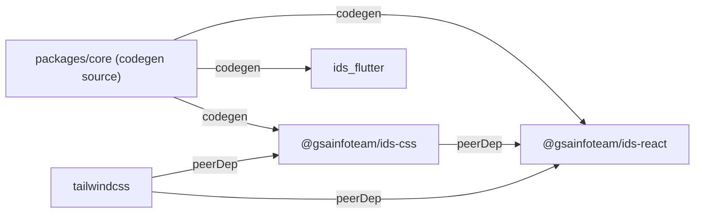

# IDS — Infoteam Design System

GIST 인포팀 서비스(지글, 팟쥐 등)의 UI를 일관되게 유지하기 위한 크로스플랫폼 디자인 시스템.

React (Web)과 Flutter (Mobile)을 동시 지원하며, 토큰 파이프라인으로 CSS·Dart 코드를 자동 생성한다.

## 패키지

| 패키지 | 설명 |
|---|---|
| `packages/core` | 토큰 소스 + Style Dictionary codegen. 배포 안 함. |
| `@gsainfoteam/ids-css` | CSS 변수 + Tailwind `@theme`. GitHub Packages 배포. |
| `@gsainfoteam/ids-react` | React 컴포넌트. GitHub Packages 배포. |
| `ids_flutter` | Flutter 컴포넌트. git dependency로 참조. |

## 환경 세팅

```bash
# pnpm이 없으면 먼저 설치
npm install -g pnpm

# 의존성 설치
pnpm install
```

Flutter 작업 시 [mise](https://mise.jdx.dev) 사용을 권장한다:

```bash
mise install   # .mise.toml에 명시된 Flutter 버전 설치
```

## CI

PR을 열면 자동으로 아래 체크가 실행된다.

- **JS**: `pnpm codegen` → 생성 파일 동기화 확인 → `typecheck` → `lint` → `build`
- **Flutter**: `flutter test`

토큰 파일(`packages/core/tokens/`)을 수정했는데 `pnpm codegen`을 실행하지 않으면 CI가 실패한다.

## 개발 워크플로우

### 토큰 수정

토큰은 `packages/core/tokens/`에서만 편집한다. 직접 생성 파일을 수정하면 안 됨.

```bash
# 1. 토큰 파일 편집
#    packages/core/tokens/palette.json
#    packages/core/tokens/semantic/*.json
#    packages/core/tokens/spacing.json 등

# 2. 생성 파일 업데이트
pnpm codegen

# 3. 생성된 파일 확인 후 커밋
#    packages/css/dist/ids.css
#    packages/react/src/tokens/types.ts
#    packages/flutter/lib/tokens/*.dart
```

### 새 색상 추가

```bash
# 1. 팔레트 값 추가
#    packages/core/tokens/palette.json

# 2. semantic 파일 추가
#    packages/core/tokens/semantic/[color].light.json
#    packages/core/tokens/semantic/[color].dark.json

# 3. codegen 실행
pnpm codegen
```

### React 컴포넌트 개발

```bash
# Storybook으로 컴포넌트 개발
pnpm storybook   # http://localhost:6006

# 빌드 확인
pnpm build

# 타입·린트 검사
pnpm typecheck
pnpm lint
```

컴포넌트는 외부 headless 라이브러리(Radix, Base UI 등)에 의존하지 않고 전부 직접 구현한다.

모든 IDS 컴포넌트는 `ThemeProvider` 없이 동작하지 않는다:

```tsx
// Storybook decorator나 App 최상단에 반드시 추가
<ThemeProvider color="blue" mode="light">
  <App />
</ThemeProvider>
```

### Flutter 컴포넌트 개발

```bash
cd packages/flutter
flutter pub get
flutter test
```

## 배포

배포는 Changesets로 관리한다. `@gsainfoteam/ids-css`와 `@gsainfoteam/ids-react`는 항상 동일한 버전을 가진다.

```bash
# 1. 변경 내용 기록 (어떤 패키지가 어떻게 바뀌는지 작성)
pnpm changeset

# 2. 생성된 .changeset/*.md 파일을 커밋에 포함해서 PR

# 3. PR 머지 후 버전 bump
pnpm changeset version   # package.json 버전 올리고 CHANGELOG 생성

# 4. 버전 bump 커밋 후 GitHub Release 생성 → CI가 GitHub Packages로 자동 배포
gh release create v1.2.3 --generate-notes
```

npm 패키지는 `secrets.GITHUB_TOKEN`으로 배포하므로 갱신할 토큰이 없다.

`ids_flutter`는 배포하지 않는다. 소비자가 릴리스 태그를 git dependency로 참조한다 ([packages/flutter/README.md](packages/flutter/README.md)).

## 의존성 구조



`core`는 런타임 의존성이 아니다. 빌드 시에만 사용하는 코드 생성기.

## 자주 쓰는 명령어

```bash
pnpm codegen      # 토큰 → css / react / flutter 생성
pnpm build        # 전체 빌드 (turbo, css → react 순서 자동)
pnpm typecheck    # TypeScript 검사
pnpm lint         # ESLint
pnpm storybook    # Storybook (포트 6006)
pnpm changeset    # 변경 내용 기록
```
