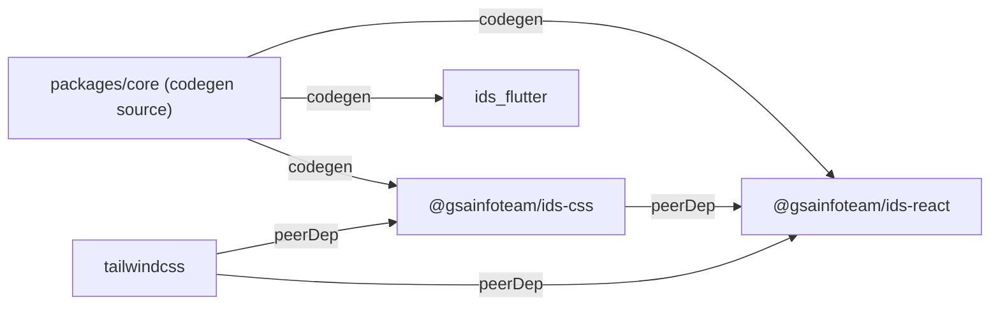

# IDS Agent Rules

## Repo structure

Monorepo (`gsainfoteam/ids`). pnpm workspace + Turborepo.

```
packages/
  core/     tokens + Style Dictionary codegen. Private — not published.
  css/      @gsainfoteam/ids-css GitHub Packages npm package. CSS variables + Tailwind @theme.
  react/    @gsainfoteam/ids-react GitHub Packages npm package. React components + ThemeProvider.
  flutter/  ids_flutter pub.dev package (publisher: gistory.me). Flutter components + ThemeProvider.
```

## Generated files — do not edit manually

These files are written by `pnpm codegen` (Style Dictionary build). Edits will be overwritten.

- `packages/css/dist/ids.css`
- `packages/react/src/tokens/types.ts`
- `packages/flutter/lib/tokens/*.dart`

To change tokens: edit files under `packages/core/tokens/`, then run `pnpm codegen`.

## Common commands

```bash
pnpm codegen          # Run Style Dictionary: core → css/react/flutter
pnpm build            # Build all packages (turbo, css before react)
pnpm typecheck        # TypeScript check all packages
pnpm lint             # ESLint all packages
pnpm storybook        # Storybook for ids-react (port 6006)
```

## Package responsibilities

**core** — Token source of truth. `sd.config.js` defines all formatters. Output goes directly to sibling packages. No build artifact. `pnpm build` in core = `style-dictionary build`.

**css** — Pure CSS package. No React dependency. Consumers import `@gsainfoteam/ids-css` and add Tailwind themselves (peerDep). Do not `@import "tailwindcss"` inside this package.

**react** — Component library. Library build via Vite (`dist/index.js`, `dist/index.cjs`). All components are implemented from scratch — no Radix, Base UI, or other headless deps. Storybook for development.

**flutter** — Dart package. Platform directories (android/, ios/, etc.) intentionally absent — this is a package, not an app. Published to pub.dev via OIDC — no token.

## Component styling

**Multi-part components use one `tv({ slots })`, not several `tv()` calls.** A component with a
root plus parts (track/thumb, trigger/panel, box/indicator) declares every part as a slot in a
single `Style`, so a variant like `colorScheme` or `size` is written once and fans out to the
parts that need it.

```tsx
export const Style = tv({
  slots: { root: '...', track: '...', thumb: '...' },
  variants: {
    size: { standard: { track: 'h-2', thumb: 'size-4' }, tiny: { track: 'h-1', thumb: 'size-3' } },
  },
  defaultVariants: { size: 'standard' },
});

const { root, track, thumb } = Style({ size });
```

Do not declare `Root`/`TrackStyle`/`ThumbStyle` as separate `tv()` calls, and do not style a part
with a bare `cn('...')` when it belongs to the same component — that hides the part from the
variant system and duplicates the variant keys.

Colors that a variant fans out to several parts go through a CSS custom property
(`[--chip-accent:var(--ids-color-primary)]`) rather than one class per part-and-scheme pair.

**Tailwind only generates classes it can see as literal text in a source file.** A class assembled
at runtime never reaches the stylesheet, and the failure is silent — the class lands in the DOM
and does nothing.

```tsx
const halo = (p: string) => `${p}ring-[3px]`; // never generated
export const focusRing = { native: 'focus-visible:ring-[3px]' }; // fine, it is literal
```

Shared style fragments (`focus-ring.ts`, `control-surface.ts`) therefore spell every variant out
in full rather than composing prefixes.

**Focus is a soft ring, never an offset outline.** Add the `focus-ring` class. It is a single
`@utility` in the CSS package that covers every trigger IDS uses — `:focus-visible` for real form
controls, `[data-focus-visible]` for components driven by `useInteractive`, and
`:has([data-text-field]:focus-visible)` for a shell wrapping a field. Borders stay `inset-ring`,
so the focus ring sits outside them and composes with `shadow-xs` instead of replacing it.

**Radius comes from the token scale.** `rounded-*` resolves to `--ids-radius-*`: controls take
`md`, surfaces (Card, Alert, Accordion, Item) take `lg`, small boxes take `xs`, pills take `full`.
Do not hardcode `rounded-[10px]`.

Icons come from `@heroicons/react` (a runtime dependency). Consumers can override any glyph
through the matching `*.Indicator` / `*.Close` part.

## ThemeProvider

Every IDS component relies on `data-color` and `data-mode` attributes injected by `ThemeProvider`. Without it, CSS variables are undefined and colors will not render.

```tsx
<ThemeProvider color="blue" mode="light">
  <App />
</ThemeProvider>
```

## Adding a new color

1. Add palette values to `packages/core/tokens/palette.json`
2. Add `packages/core/tokens/semantic/[color].light.json` and `[color].dark.json`
3. Run `pnpm codegen` and commit the generated files

## Versioning — Changesets (fixed mode)

`@gsainfoteam/ids-css`, `@gsainfoteam/ids-react` and `ids_flutter` always share the same version.

`packages/flutter` carries a minimal private `package.json` so Changesets can track it — Changesets
only reads npm manifests. `pnpm version:packages` bumps that file and then mirrors the version into
`pubspec.yaml`; pub.dev OIDC publishing requires it to match the release tag.

```bash
pnpm changeset          # Describe a change → creates .changeset/*.md
# → open PR, merge it
pnpm version:packages   # Bump package.json + pubspec.yaml, write CHANGELOGs
# → commit, open PR, merge it
git tag v1.2.3 && git push origin v1.2.3
# → release.yml publishes to GitHub Packages + pub.dev
gh release create v1.2.3 --generate-notes --verify-tag
```

## Dependency graph



`core` is never a runtime dependency of anything. It is a build-time code generator only.
