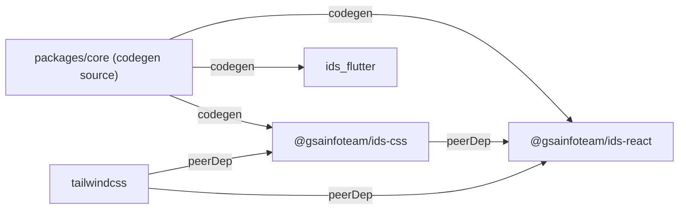

# IDS Agent Rules

## Repo structure

Monorepo (`gsainfoteam/ids`). pnpm workspace + Turborepo.

```
packages/
  core/     tokens + Style Dictionary codegen. Private — not published.
  css/      @gsainfoteam/ids-css GitHub Packages npm package. CSS variables + Tailwind @theme.
  react/    @gsainfoteam/ids-react GitHub Packages npm package. React components + ThemeProvider.
  flutter/  ids_flutter Flutter package. Consumed via git dependency, not published.
```

## Generated files — do not edit manually

These files are written by `pnpm codegen` (Style Dictionary build). Edits will be overwritten.

- `packages/css/dist/ids.css`
- `packages/react/src/tokens/types.ts`
- `packages/flutter/lib/tokens/*.dart`

To change tokens: edit files under `packages/core/tokens/`, then run `pnpm codegen`.

## Common commands

```bash
pnpm codegen          # Run Style Dictionary: core → css/react/flutter
pnpm build            # Build all packages (turbo, css before react)
pnpm typecheck        # TypeScript check all packages
pnpm lint             # ESLint all packages
pnpm storybook        # Storybook for ids-react (port 6006)
```

## Package responsibilities

**core** — Token source of truth. `sd.config.js` defines all formatters. Output goes directly to sibling packages. No build artifact. `pnpm build` in core = `style-dictionary build`.

**css** — Pure CSS package. No React dependency. Consumers import `@gsainfoteam/ids-css` and add Tailwind themselves (peerDep). Do not `@import "tailwindcss"` inside this package.

**react** — Component library. Library build via Vite (`dist/index.js`, `dist/index.cjs`). All components are implemented from scratch — no Radix, Base UI, or other headless deps. Storybook for development.

**flutter** — Dart package. Platform directories (android/, ios/, etc.) intentionally absent — this is a package, not an app. `publish_to: none` — consumers reference it by git tag.

## ThemeProvider

Every IDS component relies on `data-color` and `data-mode` attributes injected by `ThemeProvider`. Without it, CSS variables are undefined and colors will not render.

```tsx
<ThemeProvider color="blue" mode="light">
  <App />
</ThemeProvider>
```

## Adding a new color

1. Add palette values to `packages/core/tokens/palette.json`
2. Add `packages/core/tokens/semantic/[color].light.json` and `[color].dark.json`
3. Run `pnpm codegen`
4. CI runs accessibility (contrast ratio) check on PR

## Versioning — Changesets (fixed mode)

`@gsainfoteam/ids-css` and `@gsainfoteam/ids-react` always share the same version.

```bash
pnpm changeset        # Describe a change → creates .changeset/*.md
# → open PR → Changesets bot creates "Version Packages" PR automatically
# → merge "Version Packages" PR → release.yml publishes to GitHub Packages
```

## Dependency graph



`core` is never a runtime dependency of anything. It is a build-time code generator only.
