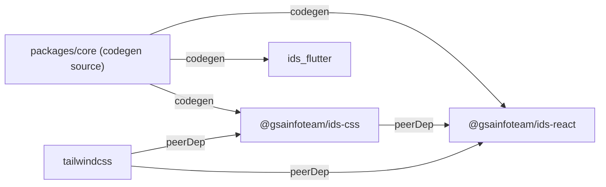

# IDS Agent Rules

## Repo structure

Monorepo (`gsainfoteam/ids`). pnpm workspace + Turborepo.

```
packages/
  core/     tokens + Style Dictionary codegen. Private — not published.
  css/      @gsainfoteam/ids-css GitHub Packages npm package. CSS variables + Tailwind @theme.
  react/    @gsainfoteam/ids-react GitHub Packages npm package. React components + ThemeProvider.
  flutter/  ids_flutter pub.dev package (publisher: gistory.me). Flutter components + ThemeProvider.
```

## Generated files — do not edit manually

These files are written by `pnpm codegen` (Style Dictionary build). Edits will be overwritten.

- `packages/css/dist/ids.css`
- `packages/react/src/tokens/types.ts`
- `packages/flutter/lib/tokens/*.dart`

To change tokens: edit files under `packages/core/tokens/`, then run `pnpm codegen`.

## Common commands

```bash
pnpm codegen          # Run Style Dictionary: core → css/react/flutter
pnpm build            # Build all packages (turbo, css before react)
pnpm typecheck        # TypeScript check all packages
pnpm lint             # ESLint all packages
pnpm storybook        # Storybook for ids-react (port 6006)
```

## Package responsibilities

**core** — Token source of truth. `sd.config.js` defines all formatters. Output goes directly to sibling packages. No build artifact. `pnpm build` in core = `style-dictionary build`.

**css** — Pure CSS package. No React dependency. Consumers import `@gsainfoteam/ids-css` and add Tailwind themselves (peerDep). Do not `@import "tailwindcss"` inside this package.

**react** — Component library. Library build via Vite (`dist/index.js`, `dist/index.cjs`); every entry in `dependencies` and `peerDependencies` stays external. Storybook for development.

**What we build and what we install.** Prefer a well-maintained package over hand-rolled logic:

- Generic helpers come from `es-toolkit` (`clamp`, `isEqual`, `noop`, `debounce`, `uniq`, ...), never a local copy.
- Classes are merged by `cn` (the package, in place of `clsx` + `tailwind-merge`). `utils/cn.ts` only adds the IDS config, and `utils/tv.ts` runs the lite build of `tailwind-variants` through the same `cn`, so one engine resolves every conflict.
- Utility engines are installed, not written: positioning `@floating-ui/react-dom`, focus `tabbable` / `focus-trap`, scroll lock `react-remove-scroll`, dates `date-fns`, numbers `@internationalized/number`, colors `culori`, textarea sizing `react-textarea-autosize`, phone numbers `libphonenumber-js`.
- Unstyled component packages are allowed only when they do not depend on Radix (for example `react-day-picker`). Radix, Base UI, cmdk and vaul are not used.
- Write it yourself only when no package fits IDS's API, or when wrapping one would keep most of the code anyway (OTPField: `input-otp` cannot take `register()`'s event `onChange`, form reset or partial-code validation).

**flutter** — Dart package. Platform directories (android/, ios/, etc.) intentionally absent — this is a package, not an app. Published to pub.dev via OIDC — no token.

## Code

**No comments.** Code carries no comments. When a line seems to need one, rename or restructure it
until it does not: a helper named for its reason (`tryCapturePointer`), a constant named for what
its value means, a condition split into named parts. Tool directives (`eslint-disable`,
`@ts-expect-error`, a `@deprecated` tag that editors strike through) are the only exception.
Explanations for users belong in the README and the story descriptions. Internal code
(`src/internal`, `src/hooks`, `src/utils`) explains itself to maintainers in a README.md in its
folder: what each module is, who uses it, how, and what breaks if it changes. A new internal module
adds its section there.

## React source layout

Components are grouped by the `유형` column of the Notion Components database. The folder is the
category, and the Storybook title is `<Category>/<Component>`.

```
packages/react/src/
  components/
    action/      Button, ButtonGroup, IconButton, IconToggle, Toggle, ToggleGroup, FloatingButton
    form/        Field and every *Field, Checkbox, Radio, Switch, Slider, Select, Rating, ...
    data/        Accordion, Avatar, Badge, Calendar, Card, Chip, Item, TimePicker, ...
    feedback/    Alert, Progress, Spinner
    layout/      AspectRatio, Divider, Spacer
    navigation/  (Breadcrumb, Pagination, Stepper, Tabs)
    overlay/     (Dialog, Drawer, Menu, Popover, Tooltip)
    typography/  Kbd, Label
    utility/     Slot, Group, ThemeProvider
  internal/      shared parts that are not exported:
                   surfaces     control-surface, toggle-surface, icon-square, field-surface, surface
                   fields       text-control (shell, Clear, useMergedRef), field-popup,
                                temporal-field, form-value, date-locale
                   behaviour    pressable, state-props, use-checked-writes, icon-label, arc
                   strings      messages
  foundations/   token stories with no component, one folder each with a story and a README:
                 Color, Typography, Radius, InteractiveState
  hooks/ utils/ tokens/
```

A new component goes into the category Notion gives it. Code shared by several components but not
public goes into `internal/`, never loose at the root of `components/`.

## Stories

Every component's `index.stories.tsx` has the same shape, in this order:

1. `Playground` — args wired to controls, nothing else.
2. `Gallery` — **required.** Every variant, size and state on one screen, built from the `Showcase` kit
   so all galleries read alike. Import it as `~story-kit`.
3. One story per feature worth showing (keyboard, paste, form integration, composition), each with
   a `play` function when the behaviour can be asserted.

```tsx
import { Showcase } from '~story-kit';

export const Gallery: Story = {
  render: () => (
    <Showcase>
      <Showcase.Section title="Variant × Size">
        <Showcase.Matrix rows={sizes} columns={variants} render={(size, variant) => (
          <Button size={size} variant={variant}>{variant}</Button>
        )} />
      </Showcase.Section>
      <Showcase.Section title="States">
        <Showcase.Row label="disabled">...</Showcase.Row>
      </Showcase.Section>
    </Showcase>
  ),
};
```

Declare the meta as `const meta = { ... } satisfies Meta<typeof X>` with `tags: ['autodocs']`, which
gives each component a Docs page (every story with Show code, plus the props table); foundation
stories opt out with `'!autodocs'`. Every story also has a Code tab beside the canvas. The global
decorator wraps every story in `ThemeProvider`, so stories do not add their own theme or page
padding.

## Component styling

**Development warnings use `isDevelopment` from `src/utils/dev.ts`, never `import.meta.env.DEV`.**
Vite bakes `import.meta.env.DEV` into the library build as `false`, which strips every warning from
the published package. `isDevelopment` reads `process.env.NODE_ENV`, which the app's bundler
replaces.

**Multi-part components use one `tv({ slots })`, not several `tv()` calls.** A component with a
root plus parts (track/thumb, trigger/panel, box/indicator) declares every part as a slot in a
single `Style`, so a variant like `colorScheme` or `size` is written once and fans out to the
parts that need it.

```tsx
export const Style = tv({
  slots: { root: '...', track: '...', thumb: '...' },
  variants: {
    size: { standard: { track: 'h-2', thumb: 'size-4' }, tiny: { track: 'h-1', thumb: 'size-3' } },
  },
  defaultVariants: { size: 'standard' },
});

const { root, track, thumb } = Style({ size });
```

Do not declare `Root`/`TrackStyle`/`ThumbStyle` as separate `tv()` calls, and do not style a part
with a bare `cn('...')` when it belongs to the same component — that hides the part from the
variant system and duplicates the variant keys.

Colors that a variant fans out to several parts go through a CSS custom property
(`[--chip-accent:var(--ids-color-primary)]`) rather than one class per part-and-scheme pair.

**Tailwind only generates classes it can see as literal text in a source file.** A class assembled
at runtime never reaches the stylesheet, and the failure is silent — the class lands in the DOM
and does nothing.

```tsx
const halo = (p: string) => `${p}ring-[3px]`; // never generated
export const focusHalo = { native: cn('focus-visible:ring-[3px]') }; // fine, literal and inside cn()
```

Shared style fragments (`control-surface.ts`, `field-surface.ts`) therefore spell every variant out
in full rather than composing prefixes.

**Every class string is written inside `cn()`, `tv()` or a JSX `className`.** Tailwind IntelliSense
only reads classes there (`.vscode/settings.json` registers `cn`, `tv` and `cva`), so a bare string
in an object, a constant, an array or a story's `args` gets no completion and no lint. A shared
fragment is an object of `cn('...')` values that components take into their own `tv` slots, and a
class joined with a variable is `cn('concentric-p-4', surface)`, not a template literal.

**Focus is a soft ring, never an offset outline.** Add the `focus-ring` class. It is a single
`@utility` in the CSS package that covers every trigger IDS uses — `:focus-visible` for real form
controls, `[data-focus-visible]` for components driven by `useInteractive`, and
`:has([data-field-input]:focus-visible)` for a shell wrapping its own input or trigger. Mark that
inner element with `data-field-input` rather than adding a component-specific `has-[...]:ring`.
Borders stay `inset-ring`, so the focus ring sits outside them and composes with `shadow-xs`
instead of replacing it. Focus also recolors that inset-ring border to primary, and an element
with `aria-invalid="true"` or `data-invalid` gets a danger border and a danger ring; neither
state is repeated in component styles.

**Radius is 10px, and containers grow it concentrically.** The scale is `standard` (10px, every
control at every size), `indicator` (4px, only for boxes under 24px such as the Checkbox box or
Kbd, where 10px would read as a circle) and `full`. There is no `sm`/`md`/`lg` radius.

A padded container (Card, Alert, Item, a popup) takes its padding from `concentric-p-*` instead of
`p-*` plus `rounded-*`. The utility sets the padding and makes the corner the content's corner
plus that padding, so a Card at `concentric-p-4` holding a Button is 26px around a 10px button.
Nesting adds up: the utility detects nested `concentric-p-*` containers with `:has()` and sums
their padding in, exact for two levels. Popovers are excluded because they are not visually
nested in the element that contains them in the DOM.

```tsx
root: 'concentric-p-4',        // padding 16px, radius 10 + 16 (+ nested padding)
root: 'concentric-p-3 px-4',   // asymmetric: radius follows the concentric value, px overrides inline
```

Do not hardcode `rounded-[14px]`, and do not pair `p-*` with a hand-computed radius.

**Structural lines are neutral.** Field borders, card edges, dividers and group seams use
`--ids-color-border` (neutral 200 light, 800 dark), the way shadcn/ui keeps chrome gray and lets
only content and focus carry color. Buttons follow the same rule: only `solid` and `soft` carry
the theme color, while `outline` and `ghost` stay neutral. `--ids-color-outline` is the
theme-tinted line for the rare edge that should itself read as the brand.

**Text-like controls share one surface.** TextField, TextArea, NumberField, PasswordField,
TelField, ChipField, Select and the date, time and color triggers draw their box from
`internal/field-surface.ts`. Their `variant` is intensity only: `outline` (default), `soft` (muted
fill) and `ghost` (no fill, no border). Put `data-field-input` on the element that takes focus and
`data-invalid` on the shell; `focus-ring` does the rest.

**A control without a native input still joins the form.** Select, a date trigger, a Rating drawn
as buttons: render `internal/form-value.tsx` inside the component's `relative` root. It writes one
hidden input per value for FormData and, when `required`, a nameless input covering the control
so the browser blocks the submit, anchors its message there and hands focus to the control.

**`dark:` follows `data-mode`.** The CSS package defines the `dark` variant against the nearest
`data-mode`, so it works in any app and inside a nested ThemeProvider, not only when the OS is dark.

**`cn` needs line height after text size.** `text-*` composites carry their own line
height, and a `leading-*` placed before one is dropped. Write `text-body-b3-regular leading-none`.

Icons come from `@heroicons/react` (a runtime dependency). Consumers can override any glyph
through the matching `*.Indicator` / `*.Close` part.

## Component API

**Callbacks.** A value callback is `onValueChange(value)`; other state callbacks are
`onCheckedChange`, `onPressedChange`, `onOpenChange` and so on. `onChange` keeps the native event
signature and only exists where a real input does. react-hook-form's `field.onChange` and TanStack
Form's `field.handleChange` both accept a plain value, so either binds to `onValueChange`.

- The form library bridges, `src/react-hook-form.tsx` and `src/tanstack-form.tsx`, share
  `internal/form-bridge.ts`: a native element reports through `onChange`, a component through
  `onValueChange` / `onCheckedChange`, and each edit reaches the library once. react-hook-form reads
  a native change event itself; TanStack Form is handed the value. Each library is an optional peer
  imported only by its own entry point.
- A component with an inner native input must not pass its own root `onChange` down to that input,
  or value mode would report the edit twice.
- A control whose value changes without an input event (a picker, a stepper) calls the
  `FieldNotifyContext` callback, so `<Field>` keeps its `data-filled` / `data-dirty` state.

**Parts.** Part props types are named `X.PartProps` (`OTPField.SlotProps`,
`ButtonGroup.SeparatorProps`). Every part is optional and falls back to a default.

**Group-like controls keep a stable focus target.** RadioGroup, CheckboxGroup, Rating and
ToggleGroup put `ref` and `id` on the root, with `tabIndex={-1}`, and hand `focus()` to the
checked or first enabled item, so a `<label htmlFor>` and react-hook-form's error focus land
somewhere that does not move as the value changes.

**Forms.** `FormValue` never submits an empty string. Form reset restores `defaultValue` without
calling the value callback (`useControllableState`'s `{ silent: true }`), the same as a native
input, which fires no change event on reset.

**Overlays.** A modal backdrop closes on `click`, not `pointerdown`; closing earlier lets the
same press land on the page underneath and pulls focus away from the trigger it was returned to.

**Nested fields.** A field drawn inside another field's shell (TelField's country Select) turns
its own ring off, so only the outer shell rings.

**Components handed to a package are declared at module level.** react-day-picker's `components`
(and any similar slot map) remounts a component that is recreated on every render, which drops
focus and state. Define them once outside the render function.

## Tests

`tests/*.test.mjs` run under `node:test` against the built `dist` with jsdom.

- Expose `Element`, `Node` and `getComputedStyle` as globals before importing `dist`:
  floating-ui and tabbable check for them when they load. Focus-trap tests also need
  `MutationObserver` and `Document`.
- jsdom has no layout, so tabbable treats every element as hidden. Stub
  `Element.prototype.getClientRects` to return one box when a test relies on focus order.
- Never assert a state that only lasts until a timer fires. Declare the duration the code reads
  (for example an inline `transition-duration`) and send the ending event yourself.
- In `play` functions, query elements again after each `await`, since the theme decorator may
  remount the story. Inputs whose focus a play checks carry `data-1p-ignore` and
  `data-lpignore="true"` so a password manager's inline menu does not take the focus.

## ThemeProvider

Every IDS component relies on `data-color` and `data-mode` attributes injected by `ThemeProvider`. Without it, CSS variables are undefined and colors will not render.

```tsx
<ThemeProvider color="blue" mode="light">
  <App />
</ThemeProvider>
```

## Adding a new color

1. Add palette values to `packages/core/tokens/palette.json`
2. Add `packages/core/tokens/semantic/[color].light.json` and `[color].dark.json`
3. Run `pnpm codegen` and commit the generated files

## Versioning — Changesets (fixed mode)

`@gsainfoteam/ids-css`, `@gsainfoteam/ids-react` and `ids_flutter` always share the same version.

`packages/flutter` carries a minimal private `package.json` so Changesets can track it — Changesets
only reads npm manifests. `pnpm version:packages` bumps that file and then mirrors the version into
`pubspec.yaml`; pub.dev OIDC publishing requires it to match the release tag.

```bash
pnpm changeset          # Describe a change → creates .changeset/*.md
# → open PR, merge it
pnpm version:packages   # Bump package.json + pubspec.yaml, write CHANGELOGs
# → commit, open PR, merge it
git tag v1.2.3 && git push origin v1.2.3
# → release.yml publishes to GitHub Packages + pub.dev
gh release create v1.2.3 --generate-notes --verify-tag
```

## Dependency graph


```mermaid
graph LR
  core["packages/core (codegen source)"]
  css["@gsainfoteam/ids-css"]
  react["@gsainfoteam/ids-react"]
  flutter["ids_flutter"]
  tw["tailwindcss"]

  core -->|codegen| css
  core -->|codegen| react
  core -->|codegen| flutter
  css -->|peerDep| react
  tw -->|peerDep| react
  tw -->|peerDep| css
```

`core` is never a runtime dependency of anything. It is a build-time code generator only.
