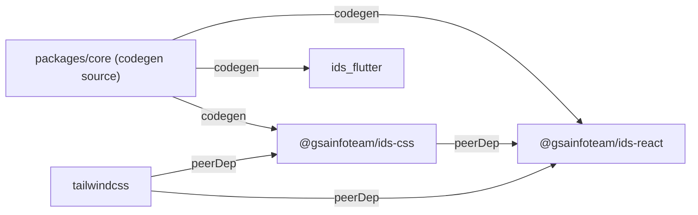

# IDS Agent Rules

## Repo structure

Monorepo (`gsainfoteam/ids`). pnpm workspace + Turborepo.

```
packages/
  core/     tokens + Style Dictionary codegen. Private — not published.
  css/      @gsainfoteam/ids-css GitHub Packages npm package. CSS variables + Tailwind @theme.
  react/    @gsainfoteam/ids-react GitHub Packages npm package. React components + IdsProvider.
  flutter/  ids_flutter pub.dev package (publisher: gistory.me). Flutter components + ThemeProvider.
examples/
  next-app-router/  tanstack-start/  astro/   private apps that install IDS the way a consumer does.
```

The examples are the install guide the React README points to. CI builds them and
`scripts/check-examples.mjs` checks that the server-rendered HTML holds IDS markup and that the
stylesheet holds a class only `@source` on `ids-react/dist` produces. Changesets ignores them.

## Generated files — do not edit manually

These files are written by `pnpm codegen` (Style Dictionary build). Edits will be overwritten.

- `packages/css/dist/ids.css`
- `packages/react/src/tokens/types.ts`
- `packages/flutter/lib/tokens/*.dart`

To change tokens: edit files under `packages/core/tokens/`, then run `pnpm codegen`.

## Common commands

```bash
pnpm codegen          # Run Style Dictionary: core → css/react/flutter
pnpm build            # Build all packages (turbo, css before react)
pnpm typecheck        # TypeScript check all packages
pnpm lint             # ESLint all packages
pnpm test             # Build, then Vitest: browser tests, every story's play, SSR and hydration of every story, dist checks
pnpm examples:build   # Build the Next.js, TanStack Start and Astro examples
pnpm examples:check   # Check their server-rendered HTML and CSS for IDS
pnpm size             # Gzip size of Button, Dialog, Select and the whole ids-react entry against .size-limit.json
pnpm storybook        # Storybook for ids-react (port 6006)
```

## Package responsibilities

**core** — Token source of truth. `sd.config.js` defines all formatters. Output goes directly to sibling packages. No build artifact. `pnpm build` in core = `style-dictionary build`.

**css** — Pure CSS package. No React dependency. Consumers import `@gsainfoteam/ids-css` and add Tailwind themselves (peerDep). Do not `@import "tailwindcss"` inside this package.

**react** — Component library. Library build via Vite, ESM only (`dist/index.js`; `@tanstack/hotkeys` ships no CommonJS), one module per source file (`preserveModules`, `sideEffects: false`); every entry in `dependencies` and `peerDependencies` stays external. Storybook for development.

**Bundle budget.** `packages/react/.size-limit.json` holds the gzip size an app pays for
`import { Button }`, `{ Dialog }`, `{ Select }` and every export, with React and the peers left
out, and CI fails past it (`pnpm size`). A limit sits 10 to 15% above the size measured when it was
set. When a change grows a size for a reason, raise that limit in the same commit and say why; a
single import growing towards the whole package means tree-shaking broke (a module with a side
effect at the top, or a part pulled in through a barrel).

**`'use client'` marks the modules that run on the client.** The build keeps one module per source
file, so each file's directive reaches `dist` (`rollup-preserve-directives`). A module that calls a
hook, creates a context or renders a component starts with `'use client'`; pure modules (`style.ts`,
logic such as `date.ts` or `number-step.ts`, types, DOM helpers and stores that client modules
call) and re-export-only `index.ts` files do not. This is what lets a Server Component import IDS
and render it without a boundary of its own. Every component index is server-safe for the same
reason: a Server Component cannot read a property of a client reference, so `<Dialog.Trigger>` and
`Button.Style()` work only when `Dialog` and `Button` themselves are plain server functions. Each
`components/<category>/<name>/index.tsx` holds no directive, no hook and no context; `Dialog` there
only renders `DialogRoot` from `root.tsx`, `Style` comes from a pure `style.ts`, and the namespace
aliases parts imported from their own client files. A part is recognised by
`elementTypeOf(child) === SelectItem`, never `child.type`: an element a Server Component hands over
arrives with a `react.lazy` wrapper as its type, which `elementTypeOf` (`utils/children.ts`) unwraps.
A root that recognises another component also accepts that component's root
(`[Avatar, AvatarRoot]`), since a Server Component hands over `<Avatar>` already rendered to
`<AvatarRoot>`. Storybook reads the props table from the
root (`docsReadFromTheRoot` in `.storybook/main.ts`), because the wrapper has no destructured
defaults to read. `tests/use-client.test.ts` checks both directions, and
`tests/server-components.test.ts` renders components, parts and `Style` from a Server Component.

**What we build and what we install.** Prefer a well-maintained package over hand-rolled logic:

- Generic helpers come from `es-toolkit` (`clamp`, `isEqual`, `noop`, `debounce`, `uniq`, ...), never a local copy.
- Classes are merged by `cn` (the package, in place of `clsx` + `tailwind-merge`). `utils/cn.ts` only adds the IDS config, and `utils/tv.ts` runs the lite build of `tailwind-variants` through the same `cn`, so one engine resolves every conflict.
- Utility engines are installed, not written:
  - overlay positioning and interactions `@floating-ui/react` (hover intent, list navigation,
    typeahead, menu trees, modal focus, delay groups), used only through `internal/overlay`;
  - focus order `tabbable`, scroll lock `react-remove-scroll`;
  - dates `@internationalized/date`, numbers `@internationalized/number`, colors `culori`;
  - decimal arithmetic `decimal.js`, so a step of `0.1` lands on `0.3` and not `0.30000000000000004`;
    only the step rules themselves (snap up, down or to the nearest grid value) are IDS's code;
  - textarea sizing `react-textarea-autosize`, phone numbers `libphonenumber-js`;
  - keyboard shortcuts `@tanstack/react-hotkeys`.
- Unstyled component packages are allowed only when they do not depend on Radix (for example `react-day-picker`). Radix, Base UI, cmdk and vaul are not used.
- Write it yourself only when no package fits IDS's API, or when wrapping one would keep most of the code anyway (OTPField: `input-otp` cannot take `register()`'s event `onChange`, form reset or partial-code validation). Written in-house for that reason:
  - the `overlay` and `toast` stores, on React's `useSyncExternalStore`. overlay-kit leaves a
    promise pending on unmount and throws on reopening an id, and zustand would replace only the
    subscribe glue;
  - Drawer gestures, ported from vaul, which is unmaintained and needs Radix Dialog;
  - toasts, ported from sonner, whose unlayered CSS beats Tailwind utilities and which sits outside
    the top layer.
  - ScrollArea, the overlay scrollbar. Radix ScrollArea (and shadcn's, built on it) is ruled out
    with Radix. OverlayScrollbars wraps the content in elements of its own, so it cannot make a
    `role="listbox"` element the scroller (the options' offset parent and `scrollTop` must stay on
    the listbox), cannot place a bar by where it is declared, and does not inset the bar ends from
    a rounded corner. What is left over native scrolling is a ResizeObserver and a thumb drag.

**flutter** — Dart package. Platform directories (android/, ios/, etc.) intentionally absent — this is a package, not an app. Published to pub.dev via OIDC — no token.

## Code

**No comments.** Code carries no comments. When a line seems to need one, rename or restructure it
until it does not: a helper named for its reason (`tryCapturePointer`), a constant named for what
its value means, a condition split into named parts. Tool directives (`eslint-disable`,
`@ts-expect-error`, a `@deprecated` tag that editors strike through) are the only exception.
Explanations for users belong in the README and the story descriptions. Internal code
(`src/internal`, `src/hooks`, `src/utils`) explains itself to maintainers in a README.md in its
folder: what each module is, who uses it, how, and what breaks if it changes. A new internal module
adds its section there.

## React source layout

Components are grouped by the `유형` column of the Notion Components database. The folder is the
category, and the Storybook title is `<Category>/<Component>`.

```
packages/react/src/
  components/
    action/      Button, ButtonGroup, IconButton, IconToggle, Toggle, ToggleGroup, FloatingButton
    form/        Field and every *Field, Checkbox, Radio, Switch, Slider, Select, Rating, ...
    data/        Accordion, Avatar, Badge, Calendar, Card, Chip, Item, TimePicker, ...
    feedback/    Alert, Progress, Spinner, Toast
    layout/      AspectRatio, Divider, Spacer, ScrollArea
    navigation/  (Breadcrumb, Pagination, Stepper, Tabs)
    overlay/     Dialog, Drawer, Menu, Popover, Tooltip
    typography/  Kbd, Label
    utility/     Slot, Group, IdsProvider
  internal/      shared parts that are not exported:
                   surfaces     control-surface, toggle-surface, icon-square, field-surface, surface,
                                slider-surface
                   fields       text-control (shell, Clear, useMergedRef), field-popup, list-styles,
                                temporal-field, form-value, date-locale
                   behaviour    pressable, state-props, use-checked-writes, icon-label, arc
                   feedback     status-palette
                   overlays     overlay (layer stack, top layer, presence, anchoring, modal layer)
                   strings      messages
  foundations/   token stories with no component, one folder each with a story and a README:
                 Color, Typography, Radius, InteractiveState
  hooks/ utils/ tokens/
```

A new component goes into the category Notion gives it. Code shared by several components but not
public goes into `internal/`, never loose at the root of `components/`.

**Component folder.** Every component keeps `index.tsx`, `root.tsx` and, when it has a `tv` Style,
`style.ts`. A component with parts, or a `root.tsx` past about 250 lines, is split further into one
file per part. Menu and Drawer show the shape:

```
drawer/
  index.tsx      Drawer and `export namespace Drawer`: types, part aliases, Style (server-safe)
  root.tsx       DrawerRoot: the root's state, context provider and markup ('use client')
  context.ts     createContext and the guard hook (useDrawerContext)
  style.ts       drawerStyle = tv({ slots, variants })
  trigger.tsx    DrawerTrigger, DrawerTriggerProps
  content.tsx    DrawerContent and the private popup it renders
  use-drawer.ts  logic hooks and pure helpers keep their own files
```

- `index.tsx` holds a hook-free root, `return <DrawerRoot {...props} />`, and the namespace only.
  The root's code, its helpers and any part the namespace used to define inline live in
  `root.tsx`; a `tv` Style lives in `style.ts`. A part is an alias with its props
  type beside it, so `Drawer.Trigger` and `Drawer.Trigger.Props` stay the public names:
  `export const Trigger = DrawerTrigger;` and
  `export namespace Trigger { export type Props = DrawerTriggerProps; }`. `Style` is
  `export const Style = drawerStyle;`.
- A part file is kebab-case (`item.tsx`, `item-indicator.tsx`) and exports `XPart` and
  `XPartProps`. A helper used by one part lives in that part's file; one shared by several parts
  gets a small file named for what it holds.
- Each public part sets its public name right after the function,
  `DrawerTrigger.displayName = 'Drawer.Trigger';`, so Show code prints `<Drawer.Trigger>` and not
  the function name. The icon-name lookup skips a `displayName` with a dot, so a part placed in an
  IconButton's `icon` never becomes its label.
- Parts and `root.tsx` import `./context`, `./style` and sibling parts directly. They import `'.'`
  only with `import type`, so no runtime cycle runs through `index.tsx`. The root recognises its parts
  (`elementTypeOf(child) === DrawerOverlay`, a set of part functions) by importing them, never
  through `Drawer.Overlay`.
- Paths imported from outside the folder (`field/context`, `select/select-options`,
  `calendar/date`, `drawer/drawer-gesture`) stay where they are.

## Stories

Every component's `index.stories.tsx` has the same shape, in this order:

1. `Playground` — args wired to controls, nothing else.
2. `Gallery` — **required.** Every variant, size and state on one screen, built from the `Showcase` kit
   so all galleries read alike. Import it as `~story-kit`.
3. One story per feature worth showing (keyboard, paste, form integration, composition), each with
   a `play` function when the behaviour can be asserted.

```tsx
import { Showcase } from '~story-kit';

export const Gallery: Story = {
  render: () => (
    <Showcase>
      <Showcase.Section title="Variant × Size">
        <Showcase.Matrix rows={sizes} columns={variants} render={(size, variant) => (
          <Button size={size} variant={variant}>{variant}</Button>
        )} />
      </Showcase.Section>
      <Showcase.Section title="States">
        <Showcase.Row label="disabled">...</Showcase.Row>
      </Showcase.Section>
    </Showcase>
  ),
};
```

Declare the meta as `const meta = { ... } satisfies Meta<typeof X>` with `tags: ['autodocs']`, which
gives each component a Docs page (every story with Show code, plus the props table); foundation
stories opt out with `'!autodocs'`. Every story also has a Code tab beside the canvas. The global
decorator wraps every story in `IdsProvider`, so stories do not add their own theme or page
padding.

**Write the demo inline in `render`.** Show code and the Code tab are how a reader learns to
compose IDS, so a story file declares no demo component of its own: the IDS tree goes straight
into `render`, and a demo shared by several stories or Gallery rows is written out at each one.
A demo that needs state is `render: function Render() { ... }`, which holds the hooks and returns
the tree, named in PascalCase so the hooks lint accepts it. A `render` without `args` shows its own
source, hooks included. A `render` that takes `args` to forward a spy (`args.onValueChange`, or
`function Render(args)` when it also needs state) shows the rendered element tree instead: the
IDS elements appear, the hook code does not. The exceptions, which stay components:

- IdsProvider's `Readout`, `ModeSwitcher` and `SetColor`, which call `useTheme` and must render
  under a nested `IdsProvider`;
- Slot's `Tag`, since building an `asChild` component is that demo;
- custom SVG icons whose name automatic labelling reads (`BellIcon`, `PinIcon`, `ComposeIcon`);
- filler with no IDS in it (ScrollArea's `Text`, `Wide` and `Grid`, FloatingButton's
  `ContainingBlock`, Badge's `Box`, the foundation tables and specimens);
- the `Showcase` kit and decorators.

Plain helpers (play queries, data factories, formatters) stay at module level.

## Component styling

**Development warnings use `isDevelopment` from `src/utils/dev.ts`, never `import.meta.env.DEV`.**
Vite bakes `import.meta.env.DEV` into the library build as `false`, which strips every warning from
the published package. `isDevelopment` reads `process.env.NODE_ENV`, which the app's bundler
replaces.

**Multi-part components use one `tv({ slots })`, not several `tv()` calls.** A component with a
root plus parts (track/thumb, trigger/panel, box/indicator) declares every part as a slot in a
single `Style`, so a variant like `colorScheme` or `size` is written once and fans out to the
parts that need it.

```tsx
export const Style = tv({
  slots: { root: '...', track: '...', thumb: '...' },
  variants: {
    size: { standard: { track: 'h-2', thumb: 'size-4' }, tiny: { track: 'h-1', thumb: 'size-3' } },
  },
  defaultVariants: { size: 'standard' },
});

const { root, track, thumb } = Style({ size });
```

Do not declare `Root`/`TrackStyle`/`ThumbStyle` as separate `tv()` calls, and do not style a part
with a bare `cn('...')` when it belongs to the same component — that hides the part from the
variant system and duplicates the variant keys.

Colors that a variant fans out to several parts go through a CSS custom property
(`[--chip-accent:var(--ids-color-primary)]`) rather than one class per part-and-scheme pair.

**Tailwind only generates classes it can see as literal text in a source file.** A class assembled
at runtime never reaches the stylesheet, and the failure is silent — the class lands in the DOM
and does nothing.

```tsx
const halo = (p: string) => `${p}ring-[3px]`; // never generated
export const focusHalo = { native: cn('focus-visible:ring-[3px]') }; // fine, literal and inside cn()
```

Shared style fragments (`control-surface.ts`, `field-surface.ts`) therefore spell every variant out
in full rather than composing prefixes.

**Every class string is written inside `cn()`, `tv()` or a JSX `className`.** Tailwind IntelliSense
only reads classes there (`.vscode/settings.json` registers `cn`, `tv` and `cva`), so a bare string
in an object, a constant, an array or a story's `args` gets no completion and no lint. A shared
fragment is an object of `cn('...')` values that components take into their own `tv` slots, and a
class joined with a variable is `cn('concentric-p-4', surface)`, not a template literal.

**Focus is a soft ring, never an offset outline.** Add the `focus-ring` class. It is a single
`@utility` in the CSS package that covers every trigger IDS uses — `:focus-visible` for real form
controls, `[data-focus-visible]` for components driven by `useInteractive`, and
`:has([data-field-input]:focus-visible)` for a shell wrapping its own input or trigger. Mark that
inner element with `data-field-input` rather than adding a component-specific `has-[...]:ring`.
Borders stay `inset-ring`, so the focus ring sits outside them and composes with `shadow-xs`
instead of replacing it. Focus also recolors that inset-ring border to primary, and an element
with `aria-invalid="true"` or `data-invalid` gets a danger border and a danger ring; neither
state is repeated in component styles.

**Radius is 10px, and containers grow it concentrically.** The scale is `standard` (10px, every
control at every size), `indicator` (4px, only for boxes under 24px such as the Checkbox box or
Kbd, where 10px would read as a circle), `container` (16px, the most a padded container's corner
grows to) and `full`. There is no `sm`/`md`/`lg` radius.

A padded container (Card, Alert, Item, a popup) takes its padding from `concentric-p-*` instead of
`p-*` plus `rounded-*`. The utility sets the padding and makes the corner the content's corner
plus that padding, up to `container`: a menu at `concentric-p-1` is 14px around its 10px rows,
and a Card at `concentric-p-4` stops at 16px instead of 26px. The formula assumes a 10px control
fills the corner; a large container holds text or space there, and the full sum reads as too round.
Nesting adds up: the utility detects nested `concentric-p-*` containers with `:has()` and sums
their padding in, exact for two levels, and the thickest chain wins. A popover is left out of the
containers around it, because the top layer draws it apart from them, but containers inside a
popover add up as they do on the page, down to an overlay inside an overlay.

```tsx
root: 'concentric-p-1',        // padding 4px, radius 10 + 4 = 14px
root: 'concentric-p-4',        // padding 16px, radius min(10 + 16 + nested, 16px)
root: 'concentric-p-3 px-4',   // asymmetric: radius follows the concentric value, px overrides inline
```

Do not hardcode `rounded-[14px]`, and do not pair `p-*` with a hand-computed radius.

**Anything that scrolls goes through `ScrollArea`.** A component that scrolls inside itself (a
popup list, a menu, a dialog body) never shows the OS scrollbar: make the scrolling element a
`ScrollArea.Viewport` (with `asChild` when it is a listbox) or the rounded container itself the
`ScrollArea` root with `asChild`. A padded root keeps its corner from `concentric-p-*` and hands
the padding to the viewport (`concentric-p-1 p-0` on the root, `p-1` on the viewport), and a
scroll area sitting in a rounded container's corner takes that corner with `rounded-[inherit]`,
since the bar ends are inset from the root's own computed radius. A `<textarea>` is a viewport
too (`ScrollArea.Viewport asChild`): it scrolls itself, and ScrollArea remeasures it on `input`.
Popover keeps its arrow outside the ScrollArea, since the viewport clips what overflows.

**Structural lines are neutral.** Field borders, card edges, dividers and group seams use
`--ids-color-border` (neutral 200 light, 800 dark), the way shadcn/ui keeps chrome gray and lets
only content and focus carry color. Buttons follow the same rule: only `solid` and `soft` carry
the theme color, while `outline` and `ghost` stay neutral. `--ids-color-outline` is the
theme-tinted line for the rare edge that should itself read as the brand.

**Neutral states climb one step at a time.** A transparent control goes rest → hover `muted` →
press `muted-hover`; a filled control goes `muted` → `muted-hover` → `muted-active`; a handle (a
ScrollArea thumb, the Drawer handle) goes `handle` → `handle-hover` → `handle-active` while
dragged. A pressed toggle takes the press step. The ladder leaves alone translucent layers over a
background it does not know (Item and Card `on-surface` overlays, Chip's `currentColor` layer,
Kbd), brand states (`/90`, `/80`, `/10`–`/20`), edge rings, disabled opacity and backdrops.

**Text-like controls share one surface.** TextField, TextArea, NumberField, PasswordField,
TelField, ChipField, Select and the date, time and color triggers draw their box from
`internal/field-surface.ts`. Their `variant` is intensity only: `outline` (default), `soft` (muted
fill) and `ghost` (no fill, no border). Put `data-field-input` on the element that takes focus and
`data-invalid` on the shell; `focus-ring` does the rest.

**A control without a native input still joins the form.** Select, a date trigger, a Rating drawn
as buttons: render `internal/form-value.tsx` inside the component's `relative` root. It writes one
hidden input per value for FormData and, when `required`, a nameless input covering the control
so the browser blocks the submit, anchors its message there and hands focus to the control.

**`dark:` follows `data-mode`.** The CSS package defines the `dark` variant against the nearest
`data-mode`, so it works in any app and inside a nested IdsProvider, not only when the OS is dark.

**`cn` needs line height after text size.** `text-*` composites carry their own line
height, and a `leading-*` placed before one is dropped. Write `text-body-b3-regular leading-none`.

**Monospace text is `font-mono`, never a hand-written `font-family`.** The CSS package extends the
utility with `font-size-adjust: var(--ids-font-size-adjust-mono)`, which sets Monaspace Neon at 95%
so code sits level with the body text and brings any fallback font to the same x-height. Do not
shrink it again with `text-[0.9em]`.

Icons come from `@heroicons/react` (a runtime dependency). Consumers can override any glyph
through the matching `*.Indicator` / `*.Close` part.
Kbd's key symbols (`⌘` `⌥` `⇧` `↩` `⌫` and the arrows) come from `lucide-react`, the one set that
has them all: drawn as text they fall back to a system font that sits them off center in the cap.

## Component API

**Callbacks.** A value callback is `onValueChange(value)`; other state callbacks are
`onCheckedChange`, `onPressedChange`, `onOpenChange` and so on. `onChange` keeps the native event
signature and only exists where a real input does. react-hook-form's `field.onChange` and TanStack
Form's `field.handleChange` both accept a plain value, so either binds to `onValueChange`.

- The form library bridges, `src/react-hook-form.tsx` and `src/tanstack-form.tsx`, share
  `internal/form-bridge.ts`: a native element reports through `onChange`, a component through
  `onValueChange` / `onCheckedChange`, and each edit reaches the library once. react-hook-form reads
  a native change event itself; TanStack Form is handed the value. Each library is an optional peer
  imported only by its own entry point.
- A component with an inner native input must not pass its own root `onChange` down to that input,
  or value mode would report the edit twice.
- A control whose value changes without an input event (a picker, a stepper) calls the
  `FieldNotifyContext` callback, so `<Field>` keeps its `data-filled` / `data-dirty` state.

**Read typing in React's `onChange`, never in a native listener.** A native `input` or `change`
listener on an element inside the React root runs before React's own, and for real input the
browser runs microtasks between listeners. A `setState` there renders first, the controlled input
is drawn again with its old `value`, React sees no change and the keystroke is lost. Field and the
text controls reread the DOM inside the `onChange` batch (`rereadInOnChangeBatch`); native
listeners stay for what React does not report, such as a form `reset` or a value written by script.

**Keys.** Widget keys go through `keyHandler` from `internal/keys.ts`: one map from `Hotkey`
strings to actions, with the `defaultPrevented`, IME composition and right-to-left checks done
once. An action that returns `false` leaves the key to the browser; otherwise the key is
`preventDefault`ed and never stopped. TanStack matches modifiers exactly, so a key that should
work with any modifier is listed through `withModifiers`. Shortcut strings, in props and maps
alike, are the `Hotkey` type (`'Mod+K'`, `'Alt+T'`). Printable keys (typeahead, `,`, digits) are
read from `event.key`, since TanStack falls back to the key's position.

**Parts.** Part props types are named `X.PartProps` (`OTPField.SlotProps`,
`ButtonGroup.SeparatorProps`). Every part is optional and falls back to a default.

**Group-like controls keep a stable focus target.** RadioGroup, CheckboxGroup, Rating and
ToggleGroup put `ref` and `id` on the root, with `tabIndex={-1}`, and hand `focus()` to the
checked or first enabled item, so a `<label htmlFor>` and react-hook-form's error focus land
somewhere that does not move as the value changes.

**Forms.** `FormValue` never submits an empty string. Form reset restores `defaultValue` without
calling the value callback (`useControllableState`'s `{ silent: true }`), the same as a native
input, which fires no change event on reset.

**Nested fields.** A field drawn inside another field's shell (TelField's country Select) turns
its own ring off, so only the outer shell rings.

**Components handed to a package are declared at module level.** react-day-picker's `components`
(and any similar slot map) remounts a component that is recreated on every render, which drops
focus and state. Define them once outside the render function.

## Overlays

Dialog, Drawer, Popover, Menu, Tooltip, Toast and the field popups are all assembled from
`internal/overlay`. Read its README before writing one.

- **Rendered in place, lifted into the top layer.** A layer renders where its JSX is written and
  shows itself with `popover="manual"`. It keeps that spot's theme, Field focus containment, form
  and Tab order, and still escapes the `overflow`, `transform` and `opacity` of its ancestors. No
  portal and no `<dialog>.showModal()`, which makes every other top-layer element inert (toasts
  included) and has no scroll lock. Tooltip is the one portal: it goes to the nearest IdsProvider
  root so an in-place hint does not shift sibling selectors (`space-*`, `divide-*`, Group seams).
- **One dismissal engine.** `useLayer` puts every open layer on one stack, ordered by open time.
  Escape (recognised with TanStack's `matchesKeyboardEvent`, skipped during IME composition) closes
  only the top layer, after inner handlers had their say through `preventDefault`;
  a press outside closes non-modal layers from the top until it reaches one that holds it; focus
  leaving closes non-modal layers and is pulled back into the top modal. Do not add floating-ui's
  `useDismiss`: it stops Escape's propagation and ignores `defaultPrevented`.
- **A modal backdrop closes on `click`, not `pointerdown`.** Closing earlier lets the same press
  land on the page underneath and pulls focus away from the trigger it was returned to.
- **A press outside blurs first.** A press outside a non-modal layer blurs the element focused
  inside it before closing: React ignores the blur fired while it removes that element, so a
  field would never report `onBlur`.
- **Modal layers** go through `ModalLayer`: floating-ui's `FloatingFocusManager` holds focus and
  hides the page with `aria-hidden` (never `inert`, which would block the toaster),
  react-remove-scroll locks the scroll.
- **Exit animations** go through `usePresence`: `data-ending-style` while leaving, the `starting:`
  variant for entering, no timers.
- **`overlay.open`.** A layer without an `open` prop binds to the `overlay.open` item it is
  rendered in, and hands `null` to its children so an inner layer does not bind to the same item.
- **Focus goes back where it came from** (`focusReturnTarget`), or to the trigger of the layer
  that held it when that element is gone. Escape and close buttons return it; a press outside
  leaves it where the press put it.
- **The outermost IdsProvider hosts** the `overlay.open` items, the default `Toaster` (replaced by
  an app-placed `<Toaster />`) and `TooltipDelayGroup`. Nested providers only change the theme.
- **A modal Drawer scales the page behind it**: only the lowest drawer transforms the outermost
  IdsProvider element, and pins that element's `position: fixed` descendants with `translate` so
  they stay where they were on screen. `scaleBackground={false}` turns it off.

## Tests

`pnpm test` builds the packages, then runs Vitest in `packages/react` (`vitest.config.ts`) as four
projects:

- `browser`: `tests/**/*.test.tsx` render from `src` in headless Chromium through Playwright, with
  Tailwind and the IDS CSS loaded and reduced motion on. `tests/stories.test.tsx` renders every
  story and runs its `play` through portable stories (`composeStories` + `run()`); a story tagged
  `'!test'` is skipped. `tests/hydration.test.tsx` renders every story with `renderToString`,
  hydrates that HTML with `hydrateRoot` and fails on a recoverable error or any `console.error`.
- `clipboard`: the browser files that call `userEvent.copy` / `cut` / `paste` or
  `navigator.clipboard`, one file at a time. Every browser context shares one system clipboard, so
  two such files in parallel paste each other's text. The config finds them by those calls.
- `ssr`: `tests/**/*.ssr.test.tsx` run in Node with no DOM. `tests/stories.ssr.test.tsx` renders
  every story with `renderToString` and fails on a throw or any `console.error` / `console.warn`,
  so a module that touches `window` or `document` at import or during render fails here. Code that
  needs the DOM runs in effects and handlers. No story is skipped.
- `node`: `tests/**/*.test.ts` check the built `dist`, such as the entry points loading without
  the optional form peers.

One file: `pnpm --filter @gsainfoteam/ids-react exec vitest run tests/select.test.tsx`. Install
Chromium once per machine:
`pnpm --filter @gsainfoteam/ids-react exec playwright install chromium`.

**Drive components the way a user does.**

- Render with `render` from `vitest-browser-react` and act with `userEvent` from `vitest/browser`.
  Clicks, keys, `fill`, `type`, `upload`, hover and `copy` / `paste` are real input.
- Press Tab with `userEvent.keyboard('{Tab}')`. `userEvent.tab()` presses it on the runner page
  without focusing the test frame, so focus lands outside the test.
- What `userEvent` cannot do goes through CDP (`cdp()` from `vitest/browser`): a held mouse button
  (`Input.dispatchMouseEvent`), IME composition (`Input.imeSetComposition`), a response held back
  (`Fetch.enable`), a color scheme (`Emulation.setEmulatedMedia`). Await one `send` before the
  first `cdp().on()`.
- A synthetic event is only for input the browser cannot produce from a test: files dropped or
  pasted from the OS, autofill, IME keydowns without CDP.
- The viewport is 414x896, below the 640px drawer breakpoint. Set it with `page.viewport(w, h)`.

**Assert what settles.**

- `await expect.element(locator)` retries until React and the browser settle. Plain `expect` is
  for spies and values.
- `toHaveTextContent` matches the whole text; `toMatchTextContent` takes part of it or a RegExp.
- `toBeDisabled` and `toBeEnabled` count `aria-disabled`. When the native attribute is the point
  (`focusableWhenDisabled`), assert `disabled` itself.
- Never assert a state that only lasts until a timer fires. Declare the duration the code reads
  (an inline `transition-duration`) and end it with `getAnimations().forEach((a) => a.finish())`,
  or fake only the clock involved: `vi.useFakeTimers({ toFake: ['Date'] })`.
- Console output of passing tests is hidden. Run with `--silent=false` to see React warnings.

**Stories.** In `play` functions, query elements again after each `await`, since the theme decorator
may remount the story. Inputs whose focus a play checks carry `data-1p-ignore` and
`data-lpignore="true"` so a password manager's inline menu does not take the focus.

## IdsProvider

Every IDS component relies on `data-color` and `data-mode` attributes injected by `IdsProvider`
(`ThemeProvider` in Flutter). Without it, CSS variables are undefined and colors will not render.

```tsx
<IdsProvider color="blue" mode="light">
  <App />
</IdsProvider>
```

## Adding a new color

1. Add palette values to `packages/core/tokens/palette.json`
2. Add `packages/core/tokens/semantic/[color].light.json` and `[color].dark.json`
3. Run `pnpm codegen` and commit the generated files

## Versioning — Changesets (fixed mode)

`@gsainfoteam/ids-css`, `@gsainfoteam/ids-react` and `ids_flutter` always share the same version.

`packages/flutter` carries a minimal private `package.json` so Changesets can track it — Changesets
only reads npm manifests. `pnpm version:packages` bumps that file and then mirrors the version into
`pubspec.yaml`; pub.dev OIDC publishing requires it to match the release tag.

pub.dev takes an OIDC publish only from a workflow that a tag push started, so `release.yml` runs on
`v*` tags and nothing else. Its `dart-lang/setup-dart` step hands the pub.dev token to every step
after it, so it comes after the last third-party action (`flutter-action` does not authenticate).

```bash
pnpm changeset          # Describe a change → creates .changeset/*.md
# → open PR, merge it
pnpm version:packages   # Bump package.json + pubspec.yaml, write CHANGELOGs
# → commit, open PR, merge it
git tag v1.2.3 && git push origin v1.2.3
# → release.yml publishes to GitHub Packages + pub.dev
gh release create v1.2.3 --generate-notes --verify-tag
```

## Dependency graph


```mermaid
graph LR
  core["packages/core (codegen source)"]
  css["@gsainfoteam/ids-css"]
  react["@gsainfoteam/ids-react"]
  flutter["ids_flutter"]
  tw["tailwindcss"]

  core -->|codegen| css
  core -->|codegen| react
  core -->|codegen| flutter
  css -->|peerDep| react
  tw -->|peerDep| react
  tw -->|peerDep| css
```

`core` is never a runtime dependency of anything. It is a build-time code generator only.
